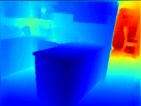
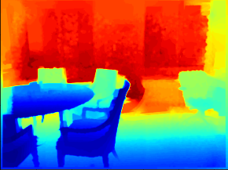
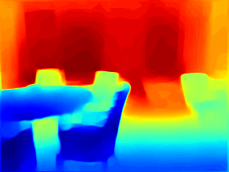

# Fully Convolutional Dense Networks for High-Quality Monocular Depth Estimation


This project addresses the problem of estimating the depth of a scene from the 2D image. A deep fully convolutional network in an encoder-decoder fashion has been used with skip connections between the encoder and the decoder.


# Results


## Qualitative

| Input RGB Image | Ground truth depth map | Our results|
|:---------------:|:----------------------:|:----------:|
||||
||||

## Quantitative

| |  ||||
| :--------------------------------------------------------------------------------------------------------------: | :----------------------------------------------------------------------------------------------------------------------------: | :--------------------------------------------------------------------------------------------------------------: | :----------------------------------------------------------------------------------------------------------------------------:| :--------------------------------------------------------------------------------------------------------------: | :----------------------------------------------------------------------------------------------------------------------------: 
|0.842|0.969|0.992|0.125|0.499|0.053


# Pre-trained models

The pretrained model can be downloaded from [this google drive link](https://drive.google.com/file/d/1qZcWoGTTVgqUkyiLq36E-YhOnqYIKkIm/view?usp=sharing). It has been trained for **18 epochs**, taking **20 hours** to train.

# Instructions
<details>
<summary>
Installation 
</summary>

To install, execute

```
pip install -r requirements.txt
```
  
</details>
<details>
<summary>
Data
</summary>
  
[NYU Depth v2 train](https://tinyurl.com/nyu-data-zip)  - (50K images) (4.1 GB)

**The train zip file contains the ```data``` folder for training, and must be extracted.** 

[NYU Depth v2 test](https://s3-eu-west-1.amazonaws.com/densedepth/nyu_test.zip) - (654 images) (1 GB)
  
**You don't have to extract the test zip file**, as the code loads the entire test zip file into memory.
</details>

<details>
<summary>
Training
</summary>
  
The script ```train.py``` contains the code for training the model. It can be invoked with the following arguments:
  
```
usage: train.py [-h] --data_dir DATA_DIR --batch_size BATCH_SIZE
                --checkpoint_dir CHECKPOINT_DIR --epochs EPOCHS
                [--checkpoint CHECKPOINT] [--lr LR]
                [--log_interval LOG_INTERVAL]

Training of depth estimation model

mandatory arguments:
  --data_dir DATA_DIR   Train directory path - should contain the 'data'
                        folder
  --batch_size BATCH_SIZE
                        Batch size to process the train data
  --checkpoint_dir CHECKPOINT_DIR
                        Directory to save checkpoints in
  --epochs EPOCHS       Number of epochs
  
optional arguments:
  --checkpoint CHECKPOINT
                        Model checkpoint path
  --lr LR               Learning rate
  --log_interval LOG_INTERVAL
                        Interval to print the avg. loss and metrics

```

</details>

<details>
<summary>
Evaluation/Inference
</summary>
  
The script ```evaluate.py``` contains the code for evaluating the model/for predicting the depth given an image. It can be invoked with the following arguments:

```

usage: evaluate.py [-h] --model MODEL [--data DATA] [--img IMG]
                   [--batch_size BATCH_SIZE] [--output_dir OUTPUT_DIR]

Evaluation of depth estimation model on either test data/own images

arguments:
  -h, --help            show this help message and exit
  --model MODEL         Model checkpoint path
  --data DATA           Test data zip path(If evaluation on test data)
  --img IMG             Image path(If evaluation on a single image)
  --batch_size BATCH_SIZE
                        Batch size to process the test data
  --output_dir OUTPUT_DIR
                        Directory to save output depth images

```

</details>
